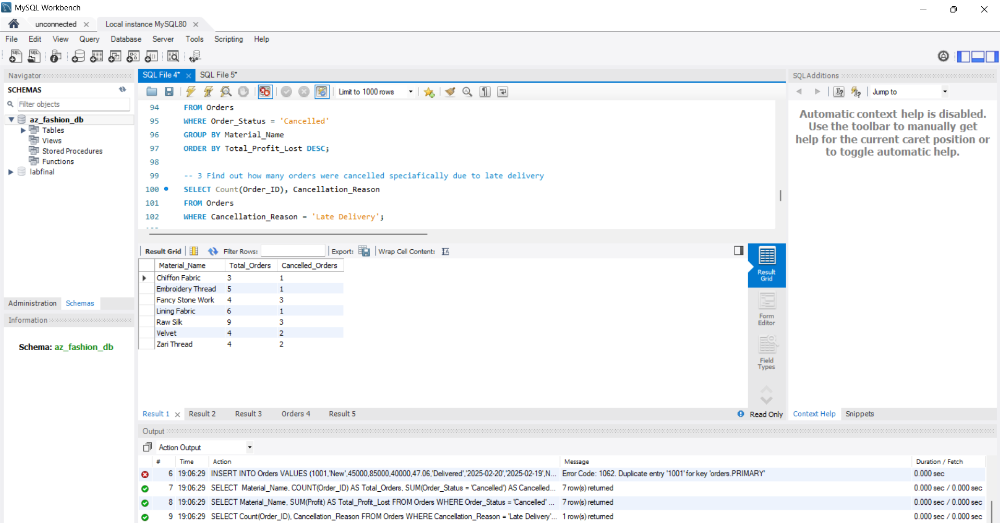

# 📊 A.Z. Fashion Business Operations Analysis

## Overview

This project analyzes operational, inventory, and financial data from **A.Z. Fashion**, a boutique fashion business, using SQL-based data analytics. The objective was to identify inefficiencies affecting order fulfillment, inventory management, and profitability, then propose data-driven solutions to improve business performance.

The analysis was conducted on **35 customer orders** and corresponding inventory records from **February 2025**.

---

## Project Objectives

* Analyze order fulfillment performance.
* Identify cancellation trends and root causes.
* Quantify financial losses caused by operational inefficiencies.
* Evaluate inventory management practices.
* Develop actionable recommendations backed by data.

---

## Tools & Technologies

* **MySQL**
* **MySQL Workbench**
* **SQL Queries**
* **Data Visualization (Charts & Graphs)**
* **Business Analytics**
* **Inventory Analysis**

---

# Key Findings

## 1. Order Fulfillment Performance

Analysis revealed a significant difference in fulfillment success between premium and lower-tier products.

### Findings

* High-value categories (**Bridal**, **Walima**, **Mehndi**) achieved a **100% completion rate**.
* Overall cancellation rate reached **37%**.
* Out of 22 Party Dress orders, **13 were cancelled**.
* Party Dress category recorded a **59.09% cancellation rate**.

### SQL Analysis

```sql
SELECT 
    Item_Type,
    COUNT(*) AS Total_Orders,
    SUM(CASE WHEN Status = 'Cancelled' THEN 1 ELSE 0 END) AS Cancelled_Count,
    CONCAT(
        ROUND(
            (SUM(CASE WHEN Status = 'Cancelled' THEN 1 ELSE 0 END) / COUNT(*)) * 100,
            2
        ),
        '%'
    ) AS Cancellation_Rate
FROM Orders
GROUP BY Item_Type;
```


### Visualization

The accompanying chart demonstrates the substantial performance gap between premium product categories and Party Dress orders.


---

## 2. Root Cause Analysis

The data showed that cancellations were primarily caused by internal operational issues rather than customer demand fluctuations.

### Cancellation Breakdown

| Reason                      | Count | Percentage |
| --------------------------- | ----- | ---------- |
| Late Deliveries             | 9     | 69.2%      |
| Material Unavailable        | 3     | 23.1%      |
| Customer Preference Changes | 1     | 7.7%       |

### Key Insight

Manual notebook-based production tracking caused scheduling delays, with management attention naturally prioritizing bridal orders over smaller projects.

### SQL Analysis

```sql
SELECT
    Cancellation_Reason,
    COUNT(*) AS Frequency,
    CONCAT(
        ROUND(
            COUNT(*) * 100.0 /
            (SELECT COUNT(*) FROM Orders WHERE Status = 'Cancelled'),
            1
        ),
        '%'
    ) AS Percentage
FROM Orders
WHERE Status = 'Cancelled'
GROUP BY Cancellation_Reason
ORDER BY Frequency DESC;
```

---

## 3. Financial Impact Assessment

Operational inefficiencies directly affected profitability.

### Findings

* Estimated monthly profit loss: **PKR 51,800**
* Profit leakage occurred entirely within the **Party Dress** category.
* Losses represented approximately **10% of potential monthly profit**.

### Business Impact

The company was losing revenue not because of insufficient demand, but because existing demand could not be fulfilled efficiently.

---

## 4. Inventory & Supply Chain Analysis

Inventory records revealed a lack of proactive stock management.

### Critical Inventory Levels

| Material         | Remaining Stock | Risk Level |
| ---------------- | --------------- | ---------- |
| Velvet           | 5 Yards         | Critical   |
| Fancy Stone Work | 2 Packets       | Critical   |

### SQL Analysis

```sql
SELECT
    Material_Name,
    Remaining_Stock,
    Status_Alert
FROM Inventory
WHERE Status_Alert IN ('Critical', 'Low Stock');
```

### Key Observation

The boutique operated below safe inventory thresholds and lacked automated reorder triggers, increasing the likelihood of production delays and cancellations.

---

# Database Validation

All queries, outputs, and verification steps were validated using **MySQL Workbench**.

Supporting screenshots:

* Screenshot 2026-05-22 190442.png
* Screenshot 2026-05-22 190500.png
* Screenshot 2026-05-22 190700.jpg

---

# Recommended Solutions

## Solution 1: Visual Production Scheduler

### Problem

Manual notebooks resulted in missed deadlines and poor workload visibility.

### Recommendation

Implement a structured production scheduling system.

### Actions

* Establish a production start date exactly **3 days before delivery deadlines**.
* Limit Party Dress intake to **5 orders per week**.
* Create a visual workflow board for order tracking.

### Expected Result

Reduced scheduling conflicts and improved on-time delivery performance.

---

## Solution 2: Buffer Stock & Red-Tag Reorder System

### Problem

Materials frequently reached critical stock levels before replenishment.

### Recommendation

Introduce inventory safety buffers and reorder thresholds.

### Example Calculation

Average Velvet consumption:

```text
35 Yards ÷ 28 Days = 1.25 Yards per Day
```

Recommended 7-day safety stock:

```text
1.25 × 7 = 8.75 ≈ 10 Yards
```

### Action

Trigger a visual "Red Tag" reorder alert whenever stock reaches **10 yards**.

### Expected Result

Prevention of stockouts and production interruptions.

---

## Solution 3: Deposit Restructuring Strategy

### Problem

Cancelled orders consumed production capacity and resources.

### Recommendation

Require a **50% non-refundable deposit** for all Party Dress orders.

### Benefits

* Filters non-serious customers.
* Improves cash flow.
* Enables immediate procurement of required materials.
* Reduces cancellation-related losses.

---

# Business Impact Forecast

Implementing the proposed solutions can:

* Reduce cancellation rates significantly.
* Improve production planning.
* Prevent material shortages.
* Increase operational efficiency.
* Recover approximately **PKR 50,000+ per month** in lost revenue.

---

# Conclusion

This project demonstrates how SQL-driven business analytics can identify operational weaknesses that are often hidden within day-to-day workflows. By replacing manual tracking methods with structured scheduling, introducing inventory safeguards, and implementing stronger order commitment policies, A.Z. Fashion can substantially improve profitability without increasing marketing spend or acquiring additional customers.

---

## Skills Demonstrated

* SQL Querying
* MySQL
* Data Cleaning
* Business Analytics
* Root Cause Analysis
* Inventory Management
* Financial Analysis
* KPI Development
* Data Visualization
* Operational Optimization
* Problem Solving
* Business Intelligence
* Reporting & Documentation
